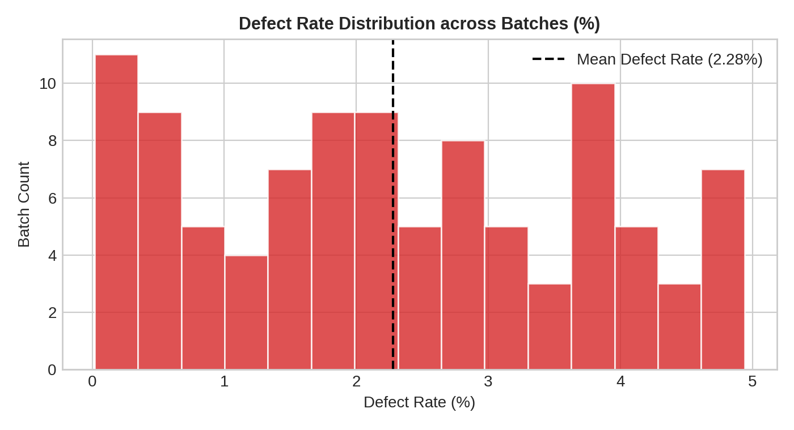
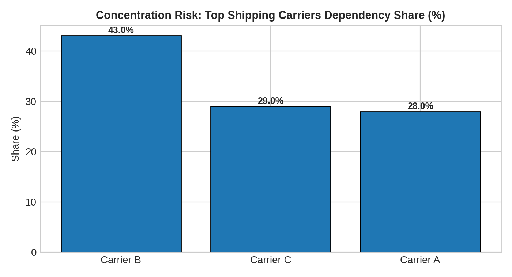

# 1. Executive Situation Report

Overall `production_volume`, averaging 567.84 units, and `Revenue generated`, with a mean of $5776.05, indicate a structurally stable operational baseline. This suggests consistent output and market performance. Despite significant quality control challenges and fluctuating inventory levels, core manufacturing throughput and plant safety remain structurally intact.

**Visual Intelligence Charts**

# 2. Operational Risk Synthesis

**Quality Control & Cost of Poor Quality:** The average `defect_rate` stands at 2.28%, with a peak of 4.94%. Critically, the system reports that over 50% of batches contain `defects`. This directly elevates the `cost of poor quality` through increased `rework` and `scrap`, leading to substantial `yield loss` and diminished `production efficiency`. This quality issue is a primary driver of inflated `Manufacturing costs` (mean $47.27) and `total_cost` (mean $529.25).

**Inventory Management & Supply Chain Stability:** `Stock levels` exhibit a mean of 47.77 units, but the minimum recorded level is 0.0 units, indicating recurrent `stockout` events. These `stockout` instances suggest vulnerabilities in `supply chain disruption` resilience or inadequate inventory optimization, which can impede `throughput` and extend `lead time` for finished goods.

**Production Efficiency & Lead Time Optimization:** The `Manufacturing lead time` averages 14 units, while the overall `Lead time` averages 17 units. Concurrently, `actual_duration_hours` average 15.96 hours. These metrics, coupled with a low average `Availability` of 48.4%, suggest significant opportunities for enhancing `production efficiency`. The low availability highly correlates with potential `downtime` events, `maintenance` inefficiencies, or process bottlenecks, directly impacting overall `oee` and `throughput`. While specific `breakdown` data is not detailed, the low availability implies underlying operational friction.

# 3. High-Priority Operational Areas Requiring Review

🔴 **HIGH PRIORITY: Quality Control & Cost of Poor Quality** - The average `defect_rate` of 2.28% and the critical alert indicating >50% of batches have `defects` represent the most significant immediate operational and financial risk. This directly drives `rework`, `scrap`, and `yield loss`, substantially increasing `Manufacturing costs` and `total_cost`.

🟡 **MODERATE PRIORITY: Inventory Management & Stockout Risk** - `Stock levels` reaching a minimum of 0.0 units indicates `stockout` events, which can disrupt `production efficiency` and extend `lead time`. This suggests vulnerabilities in `supply chain disruption` preparedness or inventory optimization.

🟡 **MODERATE PRIORITY: Production Efficiency & Lead Time Optimization** - The average `Manufacturing lead time` of 14 units and `actual_duration_hours` of 15.96 suggest opportunities for process improvement. Low `Availability` (mean 48.4%) further indicates potential `downtime` or `maintenance` inefficiencies impacting `throughput` and `oee`.

🟢 **MONITORING: Revenue & Production Volume Stability** - `Revenue generated` (mean $5776.05) and `production_volume` (mean 567.84 units) demonstrate a relatively stable baseline, indicating that despite operational friction, core output remains consistent.

# 4. Strategic Directives

*   Investigate the root causes of the average `defect_rate` of 2.28% and the reported >50% of batches with `defects`, targeting a reduction to below 1.00% to mitigate the impact on `total_cost` (mean $529.25) and `Manufacturing costs` (mean $47.27) by reducing `rework` and `scrap`.
*   Audit `Stock levels` management protocols to eliminate `stockout` events (currently at 0.0 minimum), focusing on critical raw materials to prevent `supply chain disruption` and ensure consistent `throughput`.
*   Optimize `Manufacturing lead time` from an average of 14 units and `actual_duration_hours` from 15.96 hours by analyzing `downtime` events and `maintenance` schedules to improve `production efficiency` and `oee`.
*   Develop a `predictive maintenance` strategy to address the low average `Availability` of 48.4%, aiming to reduce unplanned `breakdown` events and enhance overall `production efficiency`.

# 5. Governance & Reliability Notes

*   The dataset lacks explicit `downtime` reasons, `oee` calculations, `scrap` volumes, or `rework` costs, which limits a comprehensive assessment of `production efficiency` and `cost of poor quality`.
*   Specific `maintenance` logs and `breakdown` frequencies are unavailable, affecting the ability to fully diagnose `predictive maintenance` opportunities.
*   The `Shipping times` and `Lead time` metrics are presented in an uninterpretable timestamp format (e.g., "1970-01-01 00:00:00.00000000X"), which limits their utility in precise `supply chain disruption` analysis and could affect conclusions regarding time-based performance.

---
### 📊 Technical Appendix: Operational KPIs
| Category | KPI Name | Value | Formula | Source | Confidence | Warnings |
| :--- | :--- | :--- | :--- | :--- | :--- | :--- |
| ⚙️ Production | **Total Units Produced** | `56,784` | *Sum(Units Produced)* | ``production_volume`` | High | None |
| ⚙️ Production | **Avg Units per Production Run** | `568` | *Mean(Units Produced)* | ``production_volume`` | High | None |
| 🔬 Quality | **Avg Defect Rate** | `2.28%` | *Mean(Defect Rate)* | ``defect_rate`` | High | None |
| 🔬 Quality | **Max Defect Rate** | `4.94%` | *Max(Defect Rate)* | ``defect_rate`` | High | None |
| 📅 Vendor Performance | **Avg Vendor Quality Rating** | `2.28` | *Mean(Quality Rating)* | ``defect_rate`` | High | Low quality rating - Review vendor (<90) |
| 📅 Vendor Performance | **Min Vendor Quality Rating** | `0.02` | *Min(Quality Rating)* | ``defect_rate`` | High | Critical: Vendor quality issue (<75) |
| ⚙️ Equipment Efficiency | **Avg Equipment Availability** | `48.40%` | *Mean(Availability)* | ``Availability`` | High | Low availability - Increase uptime (<85%) |
| 💰 Manufacturing Cost | **Total Manufacturing Cost** | `$52,924.58` | *Sum(Cost)* | ``total_cost`` | High | None |
| 💰 Manufacturing Cost | **Avg Cost per Production Run** | `$529.25` | *Mean(Cost)* | ``total_cost`` | High | None |
| 💰 Manufacturing Cost | **Cost per Unit** | `$0.93` | *Total Cost / Total Units* | ``total_cost`, `production_volume`` | High | None |
| ⚠️ Concentration Risk | **Top Shipping Carriers Dependency** | `Carrier B (43.0%)` | *Max % share of Shipping carriers* | ``Shipping carriers`` | High | High dependency (> 40.0%) |
| ⚠️ Concentration Risk | **Top Supplier Name Dependency** | `Supplier 1 (27.0%)` | *Max % share of Supplier name* | ``Supplier name`` | High | None |
| ⚠️ Concentration Risk | **Top Location Dependency** | `Kolkata (25.0%)` | *Max % share of Location* | ``Location`` | High | None |
| 🛠️ System Diagnostics | **Excluded Metrics (49 Items)** | `EXCLUDED` | *N/A* | `Governance Engine` | Low | Missing required data fields across: [⏱️ Cycle Performance, ⏱️ Downtime, ⏱️ Labor, ⚙️ Equipment Efficiency, ⚙️ Production, 🏭 Supply Chain, 👥 Workforce, 💰 Labor Cost, 💰 Manufacturing Cost, 💰 Procurement, 📅 Vendor Performance, 📈 Forecasting, 📊 Demand, 📦 Inventory, 🔌 Energy, 🔧 Equipment Health, 🔬 Quality, 🚨 Safety, 🛠️ Maintenance] |
